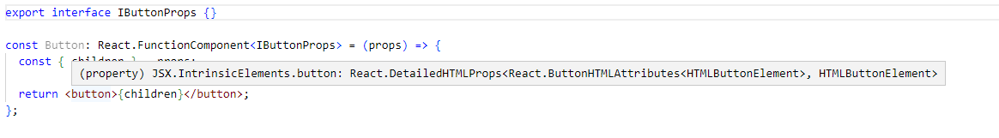

Creating component as in [video](https://www.youtube.com/watch?v=V_5ImTOmMh0)


```
npm init
npm install --save-dev @types/node @types/react @types/react-dom react react-dom typescript
```

### package.json
```
"peerDependencies": {
   "react-dom": "^18.2.0",
   "typescript": "^5.0.4"
}
```

```
"main": "dist/cjs/index.js",
"module" :"dist/esm/index.js",
 "files":["dist"],
```

We are doing two builds
- TSC - compiling package for people who are using TypeScript in the project
- CommonJS - compiling package for people who are using normal JavaScript
```
  "scripts": {
    "build": "rm -rf dist/ && npm run build:esm && npm run build:cjs",
    "build:esm":"tsc",
    "build:cjs":"tsc --module CommonJS --outDir dist/cjs"
  },
```

### Typescript

Create manually tsconfig.json, or use command
```
tsc --init
```

### Component

```
import React from "react";

export interface IButtonProps
  extends React.DetailedHTMLProps<React.ButtonHTMLAttributes<HTMLButtonElement>, HTMLButtonElement> {
  backgroundColor?: string;
  color?: string;
}

export const Button: React.FunctionComponent<IButtonProps> = (props) => {
  const { children, backgroundColor, color, style } = props;

  let _style: React.CSSProperties = style || {};
  if (backgroundColor) _style.backgroundColor = backgroundColor;
  if (color) _style.color = color;

  return (
    <button style={_style} {...props}>
      {children}
    </button>
  );
};

```




Add index.js with exports and

```
npm run build
```

https://youtu.be/V_5ImTOmMh0?t=958